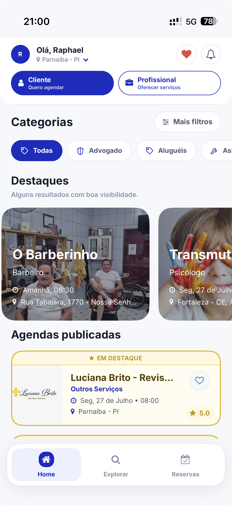
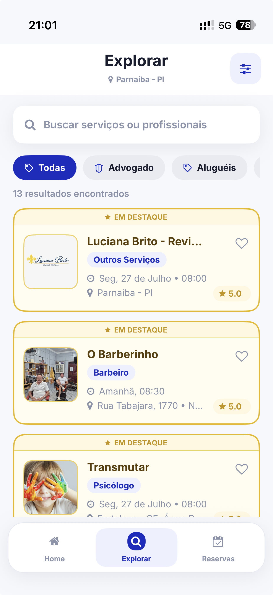
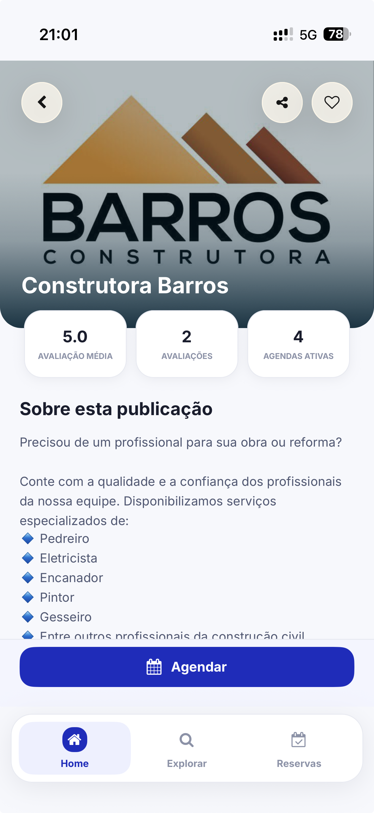
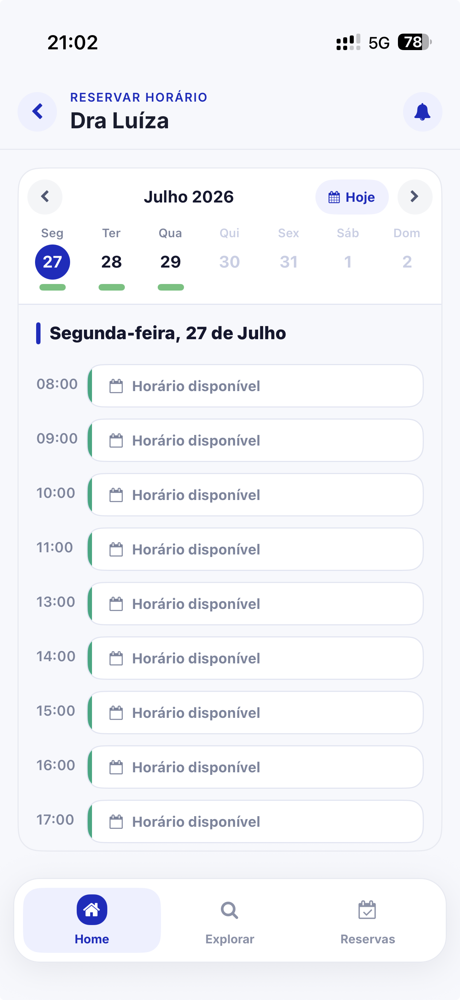

# AgendeAqui

**Real-world scheduling platform for clients, professionals, and businesses.**

> **Production product currently available in the market.**

## Confidentiality Notice

> This repository is a public case study of AgendeAqui.
>
> The production source code is private and proprietary.
>
> No original production source code is included in this repository.

Any architecture presented here is intentionally high-level. This repository does not contain proprietary implementation details, private endpoints, credentials, internal database information, or production infrastructure configuration.

## Product Overview

AgendeAqui is a real-world scheduling platform that connects clients, professionals, and businesses. It helps clients discover service providers, view availability, and book appointments through a modern experience designed for mobile and web access.

The product is currently in the market and is presented to and used with real businesses.

## My Contribution

AgendeAqui was initially developed primarily by another developer. I joined the project after the initial product foundation was already in place and started contributing to its evolution.

My contributions include:

- Improving existing features
- Fixing bugs found in real product flows
- Refining user interface details
- Improving responsiveness across mobile devices
- Testing real scheduling flows
- Developing with React Native and TypeScript
- Integrating the application with REST APIs
- Collaborating on backend-related work when needed
- Using Git branches in a collaborative development workflow
- Validating the user experience
- Applying feedback gathered from product presentations and real use with businesses

Working on an established product has given me practical experience reading and understanding an existing codebase, evolving features without breaking established flows, fixing real bugs, and making decisions based on actual user and business needs.

## Platforms

- iOS
- Android
- PWA
- Web

## Screenshots

A selection of real product screens showing the client journey from discovery to booking.

<table>
  <tr>
    <td align="center"><strong>Home</strong></td>
    <td align="center"><strong>Explore</strong></td>
    <td align="center"><strong>Professional Profile</strong></td>
    <td align="center"><strong>Schedule</strong></td>
  </tr>
  <tr>
    <td></td>
    <td></td>
    <td></td>
    <td></td>
  </tr>
</table>

## Core Features

- User registration and authentication
- Business and professional discovery
- Service catalog
- Appointment scheduling
- Available time-slot selection
- Professional profiles
- Business profiles
- Mobile-first experience
- Cross-platform access
- Deep linking

## Tech Stack

### Mobile / Frontend

- React Native
- TypeScript
- Expo

### Backend

- Java
- Spring Boot
- REST APIs

### Database

- PostgreSQL

### Tools / Infrastructure

- Git
- GitHub
- Docker
- API testing tools

My direct contribution has been strongest in mobile/frontend product evolution and product refinement, with exposure to and collaboration on integrations and backend flows when needed. I do not claim sole authorship of this architecture or technology stack.

## High-Level Architecture

```text
Mobile App / PWA
       |
       v
    REST APIs
       |
       v
Spring Boot Backend
       |
       v
   PostgreSQL
```

This diagram is intentionally simplified and does not expose proprietary implementation details.

## Real-World Engineering Challenges

- Understanding an existing codebase
- Improving features without breaking existing behavior
- Debugging production-related issues
- Maintaining mobile responsiveness across different devices
- Validating real scheduling flows
- Adapting improvements based on user feedback
- Collaborating through Git branches
- Balancing technical decisions with product and business needs

## Development Workflow

```text
Feature / Fix
      |
      v
Development Branch
      |
      v
    Testing
      |
      v
  Integration
      |
      v
Production Validation
```

My contributions follow a collaborative, branch-based Git workflow. The process focuses on implementing a scoped feature or fix, testing its behavior, integrating it with the existing product, and validating the resulting experience.

## Real-World Impact

Unlike a portfolio-only project, AgendeAqui is a real product presented to real businesses and shaped by interactions with actual users and clients. My involvement includes contact with user and business feedback, which has helped me develop a practical understanding of:

- Real user feedback
- Usability issues
- Business requirements
- Feature prioritization
- Product adoption

This experience has reinforced the importance of connecting engineering decisions to the way people use a product in practice.

## Official Links

- Website: [agendeaquiapp.com](https://www.agendeaquiapp.com/)
- Instagram: [@agendeaquiapp](https://www.instagram.com/agendeaquiapp)
- App Store: https://apps.apple.com/br/app/agendeaqui/id6767692948
- Google Play: https://play.google.com/store/apps/details?id=br.com.agendeaqui.app

## What This Case Study Demonstrates

- Experience contributing to a real production product
- Ability to work with an existing codebase
- React Native and TypeScript experience
- REST API integration
- Collaborative Git workflows
- Debugging and product improvement
- Mobile UX refinement
- Understanding of real users and business needs
- Exposure to full-stack product architecture
- Production-oriented product thinking

---

This repository documents product context and engineering experience only. It is not the AgendeAqui production codebase.
